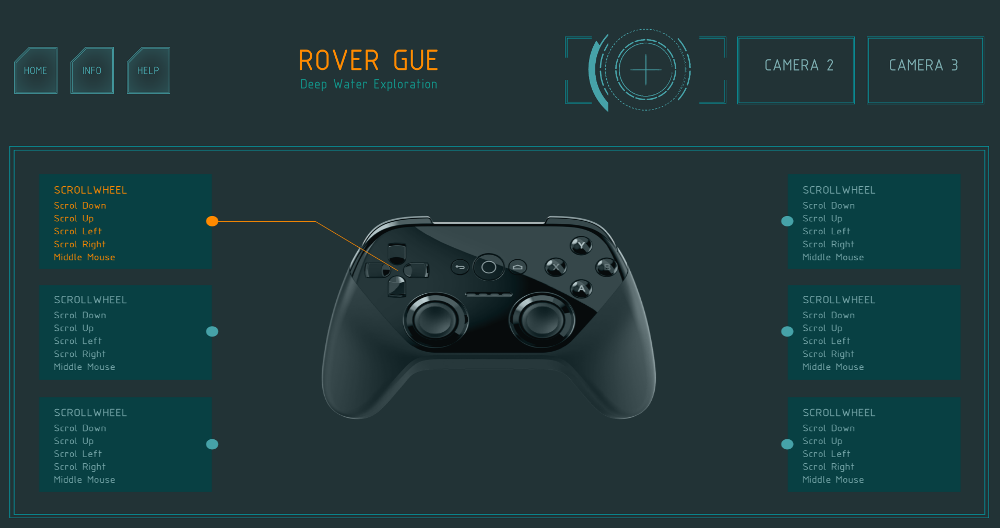

## Newcastle Engineering Society - Rover GUI - 2019
 
Creating a part of the GUI for the Rover vehicle demonstration in Python. 
Credits to the Engineering Society Design team for drawing up the UI concepts.   

**Screenshot of UI:**   

   
